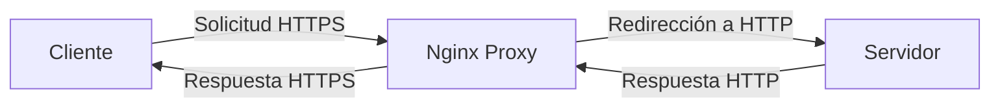

# http_to_https

## Descripción Detallada
Este proyecto implementa un proxy inverso utilizando Nginx dentro de un contenedor Docker para redireccionar automáticamente el tráfico HTTP a HTTPS, asegurando una comunicación segura mediante el uso de certificados SSL/TLS.

## Diagrama de Funcionamiento
El siguiente diagrama muestra cómo el tráfico es redirigido y manejado a través del proxy:

## Uso
Para utilizar el proxy, sigue estos pasos:
1. **Configura las variables de entorno** en `.env`.
2. **Ejecuta `./init-ssl.sh`** para generar los certificados SSL.
3. **Inicia el servicio** usando `./control_proxy.sh start`.
4. **Para el servicio** usando `./control_proxy.sh stop`.

## Configuración Detallada
La configuración se divide en varias partes:

### Variables de Entorno (`.env`)
Este archivo contiene variables esenciales como la URL a la que se hará proxy, y los puertos y rutas para los certificados SSL.

- `PROXY_PASS_URL`: URL del servidor al que se redirigen las solicitudes.
- `NGINX_HOST_PORT`, `NGINX_CONTAINER_PORT`: Puertos para el servicio Nginx.
- `CA_KEY_NAME`, `SERVER_KEY_NAME`, etc.: Nombres de los archivos de certificados y claves.

### Generación de Certificados SSL (`init-ssl.sh`)
Este script inicializa la Autoridad de Certificación (CA) y genera certificados y claves para el servidor, asegurando la encriptación del tráfico.

### Docker Compose (`docker-compose.yml`)
Configura el servicio del proxy Nginx, incluyendo mapeo de puertos, variables de entorno, y montaje de volúmenes para certificados.

### Nginx Configuration (`nginx.conf.template`)
Este archivo de configuración de Nginx define cómo se manejan las solicitudes:

- **Redirección a HTTPS**: Toda solicitud HTTP es redirigida a HTTPS.
- **Proxy Pass**: Las solicitudes son pasadas al servidor.
- **SSL Configuration**: Configura los certificados SSL y las claves.
- **Logging**: Define cómo se registran las solicitudes y respuestas.
